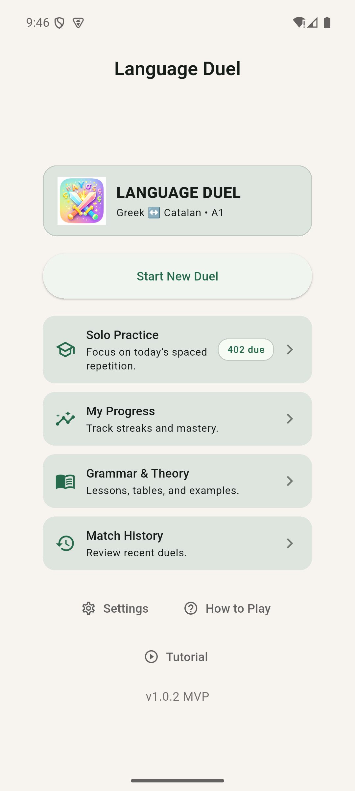
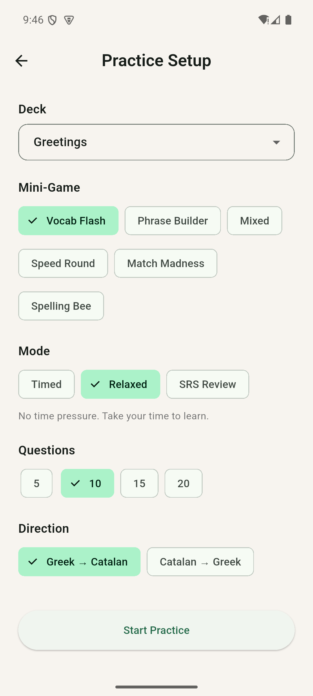
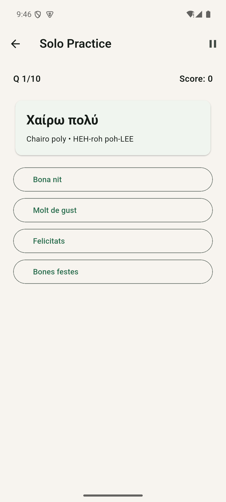

# Language Duels: two-minute walkthrough

[Back to overview](../README.md)

No account, credentials, or backend are needed. Run `flutter pub get` and
`flutter run` on an Android emulator/device or iOS simulator/device.

1. **Home:** choose Solo Practice to explore without a second player.
2. **Practice a Deck → Choose Deck:** select Greetings, Vocab Flash, Relaxed,
   10 questions, and Greek → Catalan. Relaxed mode removes time pressure.
3. **Start Practice:** read the Greek prompt and pronunciation guidance, then
   select its Catalan translation from four choices. Questions are shuffled,
   so your first prompt may differ from the capture.
4. Finish the session to review your score. Return to My Progress to inspect
   the learning records stored locally.
5. To explore multiplayer, return home and choose Start New Duel. Two players
   share one device, alternating at the handoff screens.

  
  
  

## Capture provenance

These September 2026 screenshots come from the actual Android release-mode app
in a disposable emulator, using light mode and bundled content. They are not
design mockups or iOS-device verification. To reproduce them, use
`flutter run --release` and the emulator's screenshot control after following
the steps above. Keep real player names, saved histories, and notifications
out of committed images. A local debug signing key is not a store-release key.
